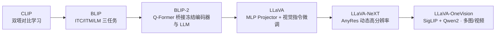
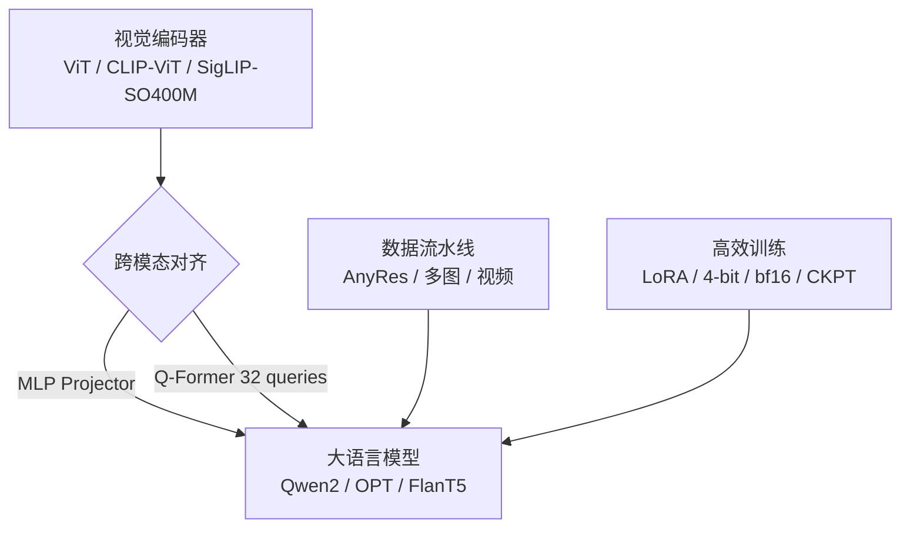

# 多模态大模型从零实现 (Multimodal LLM from Scratch)

> 基于 PyTorch **从零复现** CLIP → BLIP → BLIP-2 → LLaVA → LLaVA-NeXT → LLaVA-OneVision 完整技术演进链路的多模态大模型训练 / 推理框架。

[](https://www.python.org)
[](https://pytorch.org)
[](LICENSE)

---

## 📌 项目亮点

- **全栈自研核心模块**：手写 `LayerNorm` / `PatchEmbed` / `MultiHeadAttention`（含 causal & padding mask）/ `MLP` / `SublayerConnection` / `Block` 等 Transformer 基础组件，以及 `VisionTransformer`、`Q-Former`、`Projector`，不依赖 `timm` 等现成模型库。
- **完整技术演进线**：从双塔对比学习（CLIP），到多任务预训练（BLIP），到 Q-Former 桥接（BLIP-2），再到视觉指令微调与动态高分辨率（LLaVA 系列），一条线看懂多模态大模型的发展脉络。
- **硬核工程优化**：LoRA（PEFT）、4-bit NF4 量化（bitsandbytes）、bf16 混合精度、gradient checkpointing、chunked cross-entropy（跳过 `lm_head` 省显存）、显存峰值监控。
- **高分辨率方案**：AnyRes 动态分辨率——按长宽比选择最佳画布、切片、bilinear 池化控制 token 预算；支持多图拼接与视频帧采样。
- **中文适配**：基于 Flickr8kCN 中文图文数据集，使用 `jieba` 分词构建中文词表与 caption 流水线，训练可生成中文描述的图像理解模型。
- **多维评测体系**：R@K 图文检索、ITM 的 ROC-AUC / 准确率、生成质量的 CLIPScore 与 BERTScore，并可视化 loss 曲线。

---

## 🧭 技术演进路线图



### 模块依赖



---

## 🔬 模型对比矩阵

| 模型 | 视觉编码器 | 跨模态对齐 | 语言模型 | 高分辨率 | 量化 / 微调 | 关键创新 |
|------|-----------|-----------|---------|---------|------------|---------|
| **CLIP** | 自研 ViT | 对比学习 (ITC) | — | — | — | 双塔对比预训练，图文嵌入对齐 |
| **BLIP** | 自研 ViT | ITC + ITM + LM 三任务 | 自研文本塔 | — | — | 多任务预训练 + 检索-生成联合 |
| **BLIP-2** | 冻结 ViT | **Q-Former**（32 可学习 query） | OPT / FlanT5 | — | 冻结视觉 & LLM | Q-Former 桥接，大幅降低训练成本 |
| **LLaVA** | CLIP-ViT | MLP Projector | 可插拔 Causal LM | — | LoRA | 视觉指令微调范式 |
| **LLaVA-NeXT** | CLIP-ViT | MLP Projector | 可插拔 Causal LM | **AnyRes** | LoRA | 动态分辨率切片，提升细粒度理解 |
| **LLaVA-OneVision** | SigLIP-SO400M | MLP Projector | **Qwen2** | AnyRes + 多图/视频 | LoRA + **4-bit NF4** | 统一图像 / 多图 / 视频理解 |

---

## 📂 目录结构

```
model-work/
├── models/
│   ├── clip.py              # CLIP 双塔对比学习
│   ├── blip.py              # BLIP 多任务预训练 (ITC/ITM/LM)
│   ├── blip2.py             # BLIP-2 Q-Former 桥接
│   ├── llava.py             # LLaVA 视觉指令微调
│   ├── llava_next.py        # LLaVA-NeXT AnyRes 高分辨率
│   ├── llava_onevision.py   # LLaVA-OneVision 多图 / 视频
│   └── common/
│       ├── layers.py        # 自研 Transformer 组件库
│       ├── vision.py        # ViT 视觉编码器
│       └── load_data.py     # 数据流水线 (AnyRes / 多图 / 视频)
├── utils/
│   └── config.py            # 配置加载 (load_config)
├── parameter/
│   └── configs.py           # 配置加载 (load_config)
├── configs/
│   ├── source.yaml          # 数据集 / 训练超参配置
│   └── source1.yaml
├── requirements.txt
├── LICENSE
└── .gitignore
```

---

## 🚀 快速开始

### 1. 环境安装

```bash
pip install -r requirements.txt
```

> 建议 Python 3.10+ 与 CUDA 11.8+ 环境。4-bit 量化依赖 `bitsandbytes`，请确保与本地 CUDA 版本匹配。

### 2. 准备数据

本项目使用 **Flickr8kCN** 中文图文数据集。请自行下载数据集，并按 `configs/*.yaml` 中的路径字段配置本地目录（默认读取 `configs/source1.yaml`）。

### 3. 训练与推理

所有模型脚本均为独立入口，包路径已注入，可直接运行：

```bash
# 方式一：直接运行（推荐，已自动将仓库根加入 sys.path）
python models/clip.py
python models/blip.py
python models/blip2.py
python models/llava.py
python models/llava_next.py
python models/llava_onevision.py

# 方式二：以模块方式运行
python -m models.clip
```

- 权重文件（`.pth`）默认保存至 `./opencv/` 目录，训练完成后在对应脚本中修改 `torch.load(...)` 的权重名即可加载推理。
- 训练超参、数据路径集中在 `configs/source.yaml` 与 `configs/source1.yaml`，通过 `--config` 传入。

---

## 📊 评测

各模型内置评测脚本，覆盖：

- **图文检索**：R@K（Recall@1/5/10）、Median Rank
- **图文匹配 (ITM)**：ROC-AUC、准确率
- **生成质量**：CLIPScore、BERTScore
- **训练可视化**：loss 曲线导出

> 具体指标取决于训练数据与 epoch，请基于你自己的训练结果填写。

---

## 📚 参考文献

- Radford et al. *Learning Transferable Visual Models From Natural Language Supervision* (CLIP, 2021)
- Li et al. *BLIP: Bootstrapping Language-Image Pre-training for Unified Vision-Language Understanding and Generation* (2022)
- Li et al. *BLIP-2: Bootstrapping Language-Image Pre-training with Frozen Image Encoders and Large Language Models* (2023)
- Liu et al. *Visual Instruction Tuning* (LLaVA, 2023)
- Liu et al. *LLaVA-NeXT: Improved reasoning, OCR, and world knowledge* (2024)
- Li et al. *LLaVA-OneVision: Easy Visual Task Transfer* (2024)

---

## ⚠️ 说明

- 预训练权重文件体积较大，**未包含在仓库中**。请按上述步骤先训练，或加载 HuggingFace 对应预训练视觉 / 语言模型权重。
- 本项目聚焦**模型架构与训练流程的从零实现**，旨在深入理解多模态大模型的工作原理，非追求 SOTA 指标。

---

⭐ 如果这个项目对你理解多模态大模型有帮助，欢迎 Star & Fork。
